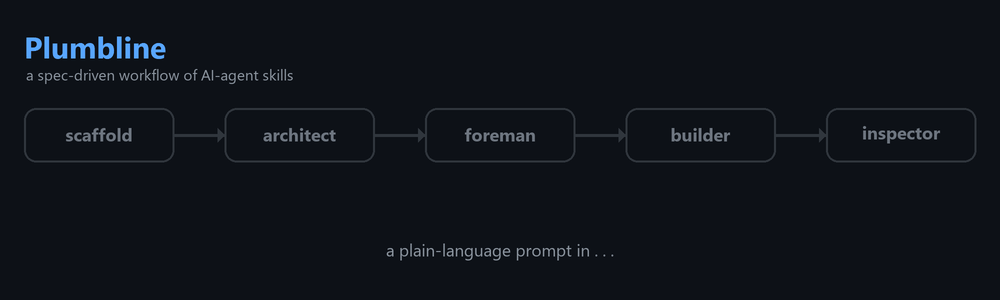
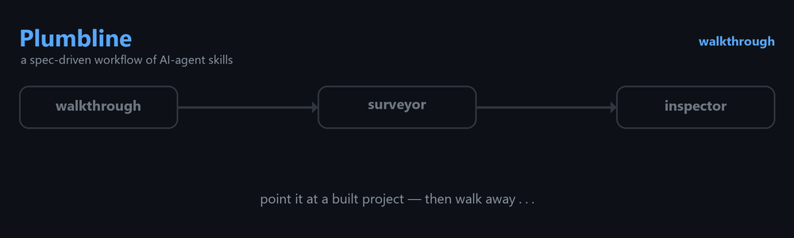

# Plumbline — a spec-driven workflow of AI-agent skills

*To build a house well you follow the plans, double-check the work, and keep everything plumb. The plumb line is the builder's reference of truth — here, your spec is that line.*



## Description

A "trust, but verify" set of agent skills that build code in a trackable way — even reporting their own deviations as they go — for better, more accountable coding.

- **Agents build, you approve.** The work runs across five single-responsibility stages — first interview to signed-off code — and stops for your sign-off at each handoff.
- **No stage does the next one's job.** `inspector` can't edit the spec to pass a test; `builder` can't invent requirements. Those boundaries are what keep it honest.
- **Coordinated by files, not calls.** Stages never call each other, so any one runs on its own — and the spec stays the single source of truth end to end.
- **Inspectable, not trusted.** A deviation log records where the build left the plan; test evidence backs every "done."
- **Two modes, each with an orchestrator.** `contractor` takes an idea to verified code in one pass (stopping once, at the spec); `walkthrough` keeps a built project aligned to its spec, unattended. Both drive the same single-responsibility skills rather than reimplementing them.

*Built for a solo developer's real projects — and run end-to-end on real features, spec through signed-off code, not just designed on paper. [Polis](https://github.com/BytesFromToby/Polis), a political-simulation game with a live-LLM negotiation layer, was specced, built, and signed off under it.*

---

## Two modes: build, then maintain

Plumbline runs in two directions. **Build** takes an idea to verified code through five forward stages. **Maintain** keeps an already-built project honest over time, on its own. The two share the same spec, the same file conventions, and one skill — `inspector` — that does duty in both.

### Build — idea to verified code

```
scaffold ──▶ architect ──▶ foreman ──▶ builder ──▶ inspector
 (once)       (spec)       (blueprint)   (code)      (proof)
                                          ▲             │
                                          └──── fix ◀───┘
```

| Stage | Owns | Produces |
|-------|------|----------|
| **scaffold** | Bootstrapping a greenfield project (run once) | Git init + the folder skeleton + a `CLAUDE.md` contract |
| **architect** | Defining *what* to build | `Planning/specs/[feature]_spec.md` with inline acceptance criteria, a decision log |
| **foreman** | Planning *how* to build it | `Planning/blueprints/[feature]_BP.md` — slices of ordered steps |
| **builder** | Writing the code | Code + tests, executed one slice at a time, with a deviation log |
| **inspector** | Proving it works | An evidence report; a dated PASS/FAIL stamp on the blueprint |

Each stage hands off through the filesystem. The user approves between stages — the agent does the work, the human stays the judge.

Every project starts in **git** — `scaffold` runs `git init` with the skeleton, and the log is the history from day one (decision docs carry the *why*; no manual changelog to silently fall behind). A project still grows through stages — **small** (one spec, flat structure) → **big** (split specs, reference tier, architecture doc); graduating across that boundary — splitting a monolith spec, extracting the reference tier — is currently a **manual** step. (Automating it in a dedicated skill is a planned addition, not part of this version.)

**Or hand the whole job to the contractor.** `contractor` is the build-mode orchestrator — the counterpart to `walkthrough`. It runs the five stages in one session, stopping exactly once, at the spec, then building, testing, and proving on its own:

```
contractor  ── one session: idea to verified code, a single gate ──
   │
   ├─ calls ─▶ scaffold ..... greenfield skeleton + CLAUDE.md (once)
   ├─ calls ─▶ architect .... interviews you, writes the spec   ◀── you approve here
   ├─ calls ─▶ foreman ...... breaks the spec into a blueprint
   ├─ calls ─▶ builder ...... every slice, building till the tests pass
   └─ calls ─▶ inspector .... fresh-eyes proof, as a separate subagent
```

It keeps the one gate that earns its place and drops the rest — but it never papers over trouble: a `builder` that gets stuck, an unresolved Open Question, or a failed inspection halts the run and surfaces it. And it can't grade its own work — `inspector` always runs as a separate agent, so the proof stays independent. Like `walkthrough`, it reimplements nothing; it only sequences.

### Maintain — keep a built project honest

Once code exists, `walkthrough` takes over — the maintain-mode orchestrator, what `contractor` is to building turned toward upkeep: run it and walk away. It works a project end-to-end — baseline, drift, coverage, docs — applying only changes safe enough to make unattended and routing everything else to a list you approve. It doesn't reimplement the checks it needs; it calls the same skills the build mode uses.



```
walkthrough  ── one autonomous session, fenced to safe changes ──
   │
   ├─ calls ─▶ surveyor    static: spec-vs-code drift
   ├─ calls ─▶ inspector   runtime: proof against the Done-when items
   │
   ├─▶ Quick-Path fixes ........ applied in place, tests re-run after each
   └─▶ everything larger ....... a dated, prioritized Recommendations list
```

| Skill | Owns | Produces |
|-------|------|----------|
| **walkthrough** | An autonomous maintenance session (no check-ins, commits nothing) | Quick-Path fixes applied + `output/walkthrough/Recommendations_YYYY-MM-DD.md` |
| **surveyor** | Static spec-vs-code drift — reads and compares, never runs the software | A dated `output/surveys/Survey_YYYY-MM-DD.md` (written even when clean) |
| **inspector** | Runtime proof against the spec — *the same skill the build lifecycle ends on* | An evidence report in `output/inspect/` |

`surveyor` and `inspector` also run standalone — `surveyor` before a feature or after a refactor when you just want a drift report; `inspector` to sign off a single slice. `walkthrough` is the hands-off orchestration of both, fenced by the **Change rules** in `CLAUDE.md`: it applies Quick-Path fixes itself and never authors a decision doc or touches a schema unattended.

---

## Where model strength goes

Plumbline is built so capability is spent where it pays and saved where it doesn't. The strong
models do the thinking at the ends of the pipeline; the rails in the middle are what make an
economy model a dependable builder.

| Stage | Model | Why |
|-------|-------|-----|
| `architect` | strong | elicits the spec — the one artifact everything else hangs on |
| `foreman` | strong | plans the slices, commits a test per criterion, writes the forward constraints a budget builder needs |
| `builder` | **economy** | fine-grained steps with exact names and addresses — the blueprint *is* the hand-holding |
| `inspector` | strong | judges evidence and test fidelity; the last line of defense, never the place to save money |

The blueprint's granularity isn't ceremony — it's the exchange rate. The finer the foreman
plans, the cheaper the builder can be. Each project's `CLAUDE.md` carries a `Builder grade:`
line (`economy` by default) that tells `foreman` how fine to grind; `walkthrough` reads the
accumulated deviation logs and recommends adjusting it when the grain and the model are
mismatched — the framework tunes itself on evidence, not anyone's self-assessment.

---

## Principles

- **The spec is the spine.** `architect` writes it, `builder` checks its work against it, `inspector` verifies the running software against it. The blueprint in the middle is a disposable plan; the spec is truth at both ends *and* in the middle.
- **Evidence over assertion.** "Done" means *shown* to work. `inspector` runs the software and captures output — a bare "PASS" is not evidence.
- **Independence is structural, not promised.** `inspector` runs with fresh eyes — ideally as a separate agent that never saw the build — so "no stake in the outcome" is enforced by isolation, not by good intentions.
- **Convention-coupled, not call-coupled.** The single-responsibility skills never call each other — they share documented file contracts (the `CLAUDE.md` declarations + folder layout) and are sequenced by data dependency, not a hard-wired chain. The two orchestrators (`contractor`, `walkthrough`) *do* invoke them, but only to sequence — they reimplement nothing, so every skill stays independently runnable.
- **Proportional ceremony.** A one-line fix doesn't get a decision doc; a schema change does. `architect` sizes its interview to the work; the **Change rules** in each project's `CLAUDE.md` give trivia a Quick Path and reserve the Full Path for features and schema.
- **Gates must earn their place.** Every stop, check, and document exists to catch a specific failure. The ones that don't get cut — this framework has been pruned as hard as it's been built.

**Design priorities, in order:** *repeatable > reliable > easy > fast.* When they conflict, the higher one wins — a reliability gain is worth a small speed cost, and consistency across runs beats either.

---

## The "Done when" contract

Acceptance criteria live *inline in the spec*, attached to each feature — not in a separate checklist that drifts. Each is observable and tagged:

```
**Done when:**
- `POST /login` with valid creds → 200 + a session cookie; bad creds → 401   `[automated]`
- the dashboard's 4 KPI cards sit above the fold at 1280px                    `[human-required]`
```

- `[automated]` — `foreman` plans a committed test that encodes it; `builder` writes that test; `inspector` runs it. "Automated" means *there is a test*, not "the agent improvised a check."
- `[human-required]` — `inspector` captures evidence (e.g. a screenshot) but never grades it; the human signs it off.

A green test proves a criterion only if the test *encodes* it — so at final sign-off `inspector`
also reads each backing test and asks: *would this fail if the criterion were violated?* A test
that can't fail (vacuous assertion, behavior mocked away) is a finding, not a pass.

---

## How the stages stay honest

- **`builder` reads the spec, not just the blueprint.** If a step contradicts the spec, it stops rather than faithfully building the wrong thing — closing the "telephone game" between plan and intent.
- **`builder` stops cleanly when stuck.** Clear rules: don't improvise a different approach, don't retry forever, never run a destructive action on the blueprint's say-so alone, and leave the codebase in a known state when you stop.
- **Deviations are an audit trail, not a blocker.** When the build diverges from the plan in a behavior-preserving way, it's logged inline and rolled up to `output/deviations/` — visible at the end whether or not inspection runs.
- **`inspector` may stamp a result but never edit criteria.** It can record `✅ PASS — <date>` on the blueprint; it cannot touch a step, a Done-when, or the spec to make something pass.
- **Inspection is risk-weighted, not ritual.** `foreman` flags slices that touch schema, auth, destructive operations, or cross-module seams `[inspect]` — those get a hard mid-slice inspector stop; the rest flow on green tests. The final sign-off is always inspected.
- **Repairs run on rails too.** A failed inspection routes back to `builder` in **fix mode**: the report's failure items become the step list, the same stuck/deviation rules apply, and the loop always closes with re-inspection — the most fragile moment in the pipeline is governed, not improvised.
- **The blueprint never forgets.** Regenerating after a spec update preserves checkboxes, inspector stamps, and deviation notes on unaffected slices; changed slices are marked stale, not erased. Regeneration can't delete the audit.

---

## Folder conventions

**`Planning/` = the living plan · `docs/` = the record & reference · `output/` = skill output.**

| Path | Holds |
|------|-------|
| `Planning/specs/[feature]_spec.md` | Specs — the source of truth |
| `Planning/reference/` | Shared definitions specs cite (data models, constants) |
| `Planning/blueprints/[feature]_BP.md` | Per-feature build plans |
| `docs/decisions/` | Decision logs (append-only) |
| `docs/architecture.md` | The as-built system map — written once modules need one |
| `output/inspect/` | Inspector reports + evidence |
| `output/deviations/` | Builder deviation rollups |
| `output/surveys/` | Surveyor drift reports (`Survey_YYYY-MM-DD.md`) |
| `output/walkthrough/` | Walkthrough log + recommendations (`…_YYYY-MM-DD.md`) |

`scaffold` lays the full folder skeleton up front as guide-rails and inits **git** — the log is
the history from day one; `docs/decisions/` carries the why.

---

## The CLAUDE.md contract

`scaffold` writes a single `CLAUDE.md` contract into each project; every skill reads it. It carries:

- **Identity** — one line on what the project is and why.
- **Stack + Commands** — the test command and the run/demo command (must be *real* — `inspector` depends on it), plus a UI-evidence tool for web stacks.
- **Builder grade** — `economy` (default) or `frontier`; tells `foreman` how fine to grind the blueprint for the model that will build.
- **History** — git, from scaffold onward; the log is the history, `docs/decisions/` the rationale.
- **Where things live** — the folder map, so a reader or agent orients without spelunking.
- **Change rules** — the Quick Path / Full Path for any change (new *test* files are the one Quick-Path file-creation exception). Doctrine every skill reads, not a skill you invoke.
- **Version stamp** — the Plumbline version the project was scaffolded under, so skill drift is detectable later.
- **How to work here** + the skills flow.

The spec *format* isn't copied into the contract — it's authoritative in `architect` (which writes specs), so there's no separate template to drift.

---

## Not a skill: the order of operations

The sequence for any *single* change isn't a stage you invoke — it lives as the **Change rules** in each project's `CLAUDE.md` (Quick Path for trivia, Full Path for features and schema). Every skill reads the same doctrine, so the workflow stays consistent without one skill ever having to call another.

---

## Version

**v1.0** — each skill carries a `version:` in its frontmatter, and every scaffolded project's
`CLAUDE.md` records the version it was born under, so a project can tell when the skills have
moved on without it.

## License

[MIT](LICENSE) © 2026 BytesFromToby
